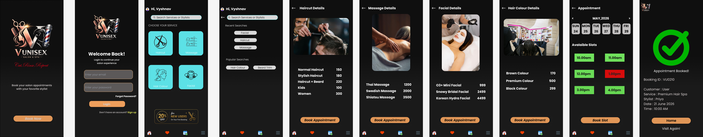

# 💇 V Unisex Salon App – UI/UX Design

## 📌 Project Overview

V Unisex Salon is a mobile application UI/UX design created in Figma for salon appointment booking and service management.

The application allows users to:

- Login and Register
- Browse salon services
- Search for services
- View service pricing
- Book salon appointments
- Select available time slots
- Receive booking confirmation

---

## 🎯 Features

- Splash Screen
- Login Screen
- Home Screen
- Search Screen
- Haircut Details
- Massage Details
- Facial Details
- Hair Colour Details
- Appointment Booking
- Booking Confirmation
- Interactive Prototype

---

## 📱 Screens Designed

| Screen | Description |
|----------|-------------|
| Splash Screen | App welcome screen |
| Login | User login |
| Home | Browse available services |
| Search | Search services |
| Haircut Details | Haircut packages and pricing |
| Massage Details | Massage packages and pricing |
| Facial Details | Facial packages and pricing |
| Hair Colour Details | Hair colour options and pricing |
| Appointment | Slot selection and booking |
| Confirmation | Booking success screen |

---

## 🎨 Design Tools

- Figma
- UI Design
- Prototyping
- User Flow Design

---

## ✂️ Services Included

- Haircut
- Massage
- Facial
- Hair Colour

---

## 📸 App Screenshots

### Splash Screen

### Login Screen

### Home Screen

### Search Screen

### Haircut Details

### Massage Details

### Facial Details

### Hair Colour Details

### Appointment Booking

### Booking Confirmation

## 📱 Complete App Preview

---

## 🔗 Project Links

### Figma Design File
https://www.figma.com/design/mAVWYYfhzhv3T3CU6kZeAV/Task-2?node-id=0-1&t=HKnzhiScSvgfDNNn-1

### Interactive Prototype
https://www.figma.com/proto/mAVWYYfhzhv3T3CU6kZeAV/Task-2?node-id=0-1&t=HKnzhiScSvgfDNNn-1

---

## 👨‍💻 Designed By

**IYYAPPAN VYSHNAV**

UI/UX Internship Project – FUTURE_UX_02

2026
